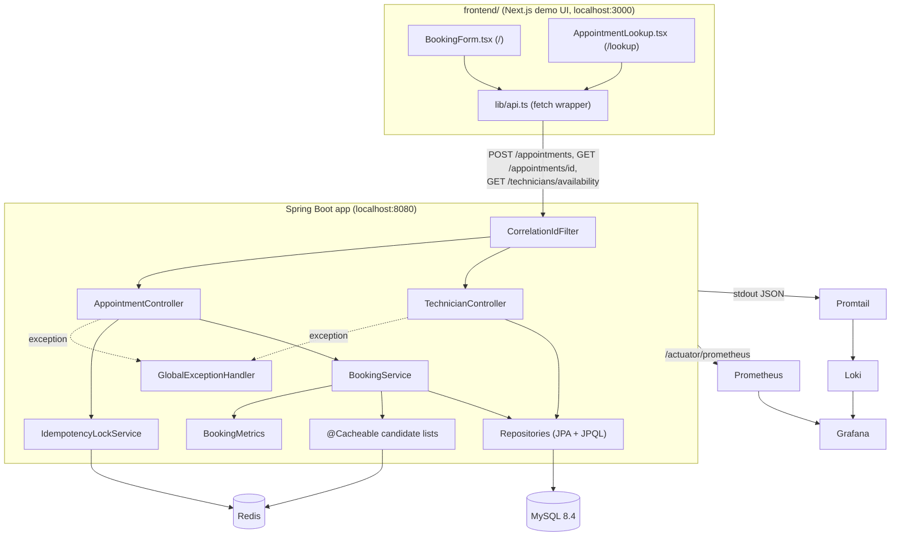
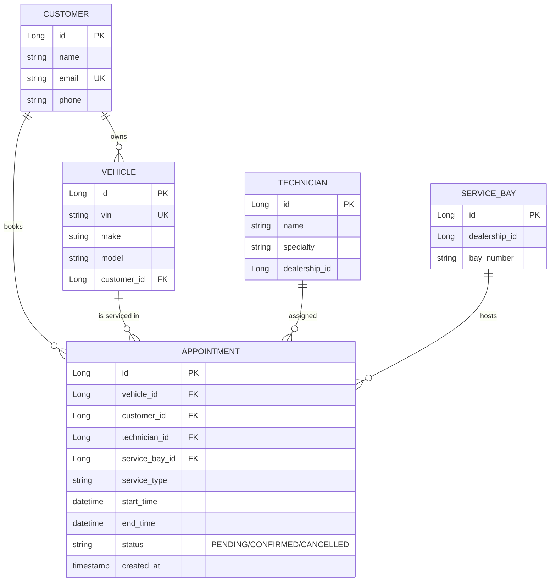
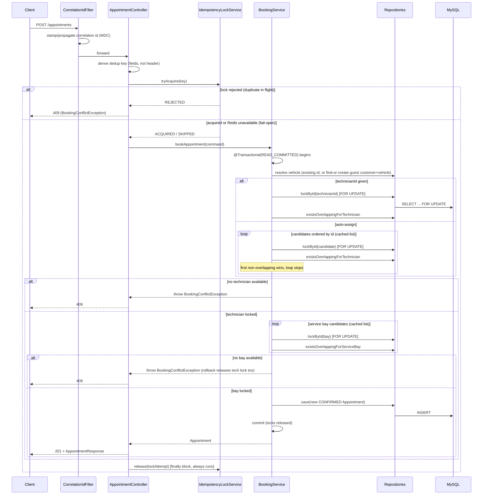
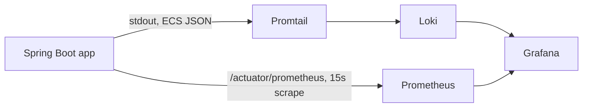

# Components, Flows & Logic — Unified Service Scheduler

Generated reference doc. Complements [`design.md`](design.md) (why decisions
were made) with an exhaustive **what exists and how it behaves** map:
every component, every request flow, every piece of non-obvious logic,
backend and frontend.

---

## 1. System Map



---

## 2. Backend Components

### 2.1 Web layer

| Component | File | Role |
|---|---|---|
| `CorrelationIdFilter` | `config/CorrelationIdFilter.java` | Runs first in the filter chain. Reads/generates `X-Correlation-Id`, puts it in SLF4J MDC, echoes it in the response header, logs `method/uri/status/durationMs` on completion. |
| `AppointmentController` | `web/AppointmentController.java` | `POST /appointments`, `GET /appointments/{id}`. Derives the idempotency key, gates via `IdempotencyLockService`, delegates booking to `BookingService`, maps `Appointment` → `AppointmentResponse`. |
| `TechnicianController` | `web/TechnicianController.java` | `GET /technicians/{id}/availability`, `GET /technicians/availability`. Read-only; returns busy windows computed from confirmed appointments. |
| `GlobalExceptionHandler` | `web/GlobalExceptionHandler.java` | `@RestControllerAdvice`. Maps `ResourceNotFoundException`→404, `BookingConflictException`→409, `MethodArgumentNotValidException`→400, always attaching the current MDC correlation id to the `ErrorResponse` body. |
| `WebConfig` | `config/WebConfig.java` | CORS: allows `http://localhost:3000` (the frontend dev server) on GET/POST/PUT/DELETE/OPTIONS. |

### 2.2 Service layer

| Component | File | Role |
|---|---|---|
| `BookingService` | `service/BookingService.java` | **The only place business logic lives.** Auto-assigns or validates a technician, finds a free service bay, persists the appointment — all in one `@Transactional(isolation = READ_COMMITTED)` method. See §4.1 for the algorithm. |
| `BookAppointmentCommand` | `service/BookAppointmentCommand.java` | Immutable input record to `BookingService` — decouples the service from the web-layer DTO. |
| `IdempotencyLockService` | `service/IdempotencyLockService.java` | Wraps a Redisson `RLock` keyed `idempotency:<derived-key>`. `tryAcquire` = `tryLock(wait=0, lease=30s)`. Fails open (returns `SKIPPED`) on any Redis error. |
| `BookingMetrics` | `service/BookingMetrics.java` | Two Micrometer counters: `booking.attempts.total`, `booking.conflicts.total`. |

### 2.3 Persistence layer

| Component | File | Role |
|---|---|---|
| `AppointmentRepository` | `repository/AppointmentRepository.java` | `findByIdWithDetails` (eager `join fetch` on vehicle/customer/technician/serviceBay — required because `open-in-view=false` closes the Hibernate session at the repository boundary). `existsOverlappingForTechnician` / `existsOverlappingForServiceBay` — half-open interval overlap test. `findOverlappingForTechnician` — same predicate, returns rows (used for the availability endpoint). |
| `TechnicianRepository` | `repository/TechnicianRepository.java` | `findBySpecialtyAndDealershipIdOrderById` (`@Cacheable`), `lockById` (`SELECT ... FOR UPDATE`). |
| `ServiceBayRepository` | `repository/ServiceBayRepository.java` | `findByDealershipIdOrderById` (`@Cacheable`), `lockById`. |
| `CustomerRepository`, `VehicleRepository` | same package | `findByEmail`, `findByVin` for guest-booking find-or-create. |

### 2.4 Domain model



Schema is versioned via Flyway (`db/migration/V1`–`V4`):
- **V1** — base schema, plus a `CHECK (end_time > start_time)` constraint and
  composite indexes `(technician_id, status, start_time, end_time)` /
  `(service_bay_id, status, start_time, end_time)` leading with the resource
  column, matching the overlap query's `WHERE` clause shape.
- **V2** — seed data: 2 dealerships, 6 technicians, 3 bays, 3 customers/vehicles.
- **V3** — adds `customer.phone`.
- **V4** — adds a `TIRE_ROTATION` technician at dealership 2 (coverage gap fix).

Note: `dealershipId` is a plain `Long` column, not a foreign key to a
`dealership` table — dealerships aren't modeled as an entity (out of scope).

### 2.5 Config / infra

| Component | File | Role |
|---|---|---|
| `CacheConfig` | `config/CacheConfig.java` | Registers 10-minute TTL for `technicianCandidates` / `serviceBayCandidates` caches; installs a `CacheErrorHandler` that logs and swallows Redis get/put/evict/clear errors (fail-open). |
| `RedissonConfig` | `config/RedissonConfig.java` | Builds `RedissonClient` from Spring's `DataRedisConnectionDetails` (so it follows Testcontainers overrides in tests automatically). |
| `application.properties` | `resources/` | `ddl-auto=validate` (Flyway owns schema), `open-in-view=false`, `spring.cache.type=redis` (forced — Redisson's JSR-107 provider would otherwise win auto-config and silently bypass `CacheConfig`'s TTLs), structured ECS JSON logging, actuator exposure (`health,info,metrics,prometheus`). |

### 2.6 Exceptions & DTOs

- `ResourceNotFoundException` → 404, `BookingConflictException` → 409 (`exception/`).
- Request: `CreateAppointmentRequest` — bean-validated (`@NotBlank`, `@NotNull`, `@Email`), plus two cross-field `@AssertTrue` checks: `desiredEnd > desiredStart`, and "either `vehicleId`, or all 5 guest fields, must be present."
- Responses: `AppointmentResponse` (flattened appointment + related names), `AvailabilityResponse` (single-technician or aggregate-list shape via nested `TechnicianAvailability`/`BusyWindow` records), `ErrorResponse` (status/error/message/correlationId/timestamp/fieldErrors).

---

## 3. API Surface

| Method | Path | Purpose | Success | Failure modes |
|---|---|---|---|---|
| `POST` | `/appointments` | Create/auto-assign a booking | `201` | `400` validation, `404` bad vehicle/technician/dealership mismatch, `409` no availability or duplicate in-flight submit |
| `GET` | `/appointments/{id}` | Fetch one appointment | `200` | `404` |
| `GET` | `/technicians/{id}/availability?date=` | One technician's busy windows for a day | `200` | `404` unknown technician |
| `GET` | `/technicians/availability?dealershipId=&serviceType=&date=` | Every qualified technician's busy windows for a day (calendar/slot-picker feed) | `200` (list) | — |
| `GET` | `/actuator/health` \| `/metrics` \| `/prometheus` | Ops | `200` | — |

---

## 4. Core Logic & Flows

### 4.1 `POST /appointments` — full request lifecycle



### 4.2 Why the locking actually prevents double-booking

This is the load-bearing logic of the whole system (`BookingService.bookAppointment`,
`AppointmentRepository`):

1. `@Transactional(isolation = Isolation.READ_COMMITTED)` **overrides**
   MySQL's default `REPEATABLE_READ`. Reason: under `REPEATABLE_READ`,
   InnoDB snapshots a transaction's plain (non-`FOR UPDATE`) reads at the
   transaction's *first* plain `SELECT` — here, the vehicle lookup, which
   happens before any lock. Every concurrent transaction would then check
   overlap against that same stale pre-lock snapshot and all would
   succeed, even after correctly waiting on the row lock. `READ_COMMITTED`
   makes every plain `SELECT` re-read latest-committed data.
2. Candidates (technicians, then bays) are iterated **in id order**, and
   each candidate row is `SELECT ... FOR UPDATE`-locked *before* its
   overlap is checked. The lock, not the overlap query, is the actual
   synchronization primitive: two transactions racing for the same
   technician both attempt the same row lock; the second blocks until the
   first commits/rolls back, then re-checks overlap against what the first
   just committed.
3. Overlap test is a standard half-open-interval check
   (`a.startTime < :end AND :start < a.endTime`, status = `CONFIRMED`) —
   strict inequalities mean back-to-back slots (one ends exactly when the
   next starts) are **not** a conflict.
4. If either search exhausts its candidate list with no free row, the
   method throws `BookingConflictException`; Spring's `@Transactional`
   rolls the transaction back, releasing every lock acquired so far.
5. Guest-booking gap (documented, accepted): `resolveVehicle`'s
   find-or-create-by-VIN is not itself lock-protected, so two concurrent
   guest bookings with an identical brand-new VIN can both miss the
   `findByVin` lookup and race on the unique constraint at insert — out of
   scope because it doesn't touch the double-booking guarantee.

### 4.3 Idempotency (dedup) flow

- Key is **derived server-side**, no client header:
  `desiredStart|desiredEnd|dealershipId|serviceType|technicianId-or-"any"|customerEmail-or-"vehicle:<id>"`.
- `IdempotencyLockService.tryAcquire`: Redisson `RLock`, `tryLock(wait=0,
  lease=30s)`. Zero wait means a concurrent duplicate gets an *immediate*
  409, never queues.
- Outcomes: `ACQUIRED` (proceed, must release in `finally`), `REJECTED`
  (409 before `BookingService` even runs), `SKIPPED` (blank key or Redis
  unreachable — proceeds without the lock, logged as a warning). This is a
  **UX convenience**, not a correctness mechanism — §4.2's MySQL locking is
  what actually prevents double-booking; Redis being down never changes a
  booking outcome.

### 4.4 Candidate-list caching flow

- `TechnicianRepository.findBySpecialtyAndDealershipIdOrderById` and
  `ServiceBayRepository.findByDealershipIdOrderById` are `@Cacheable`
  (10-min TTL, Redis-backed).
- Only the **candidate list** is cached — never the overlap/`FOR UPDATE`
  check. Every booking still hits MySQL for the actual availability
  decision; the cache only shortcuts "which rows to consider trying,
  in what order."
- No active invalidation exists (no update/delete endpoint for
  technician/bay master data) — TTL expiry is the only eviction path.
- `CacheErrorHandler` (see §2.5) makes a Redis outage degrade to
  "always cache-miss, always hit MySQL" instead of raising an exception
  out of `BookingService`.

### 4.5 `GET /technicians/availability` flow

1. Look up every technician matching `(specialty=serviceType,
   dealershipId)`, ordered by id (same cached repository call
   `BookingService` uses).
2. For each, query `findOverlappingForTechnician` for `[date 00:00, date+1
   00:00)` with status `CONFIRMED`, map to `BusyWindow(start, end)`.
3. Return one `TechnicianAvailability` per technician. Purely read-only —
   no locks, no cache write beyond the shared candidate-list cache reuse.
   Powers the frontend's slot grid without either side needing to know a
   technician id up front.

### 4.6 Guest booking / vehicle resolution logic (`resolveVehicle`)

```
vehicleId present?
├─ yes → load by id, 404 if missing
└─ no  → find customer by email, else create
         find vehicle by VIN under any customer, else create under
         the resolved customer
```
Validated at the DTO level (`CreateAppointmentRequest.isVehicleIdentificationValid`):
either `vehicleId`, or all of `customerName` + `customerEmail` + `vehicleVin`
+ `vehicleMake` + `vehicleModel`, must be present — enforced before the
request ever reaches `BookingService`.

### 4.7 Explicit technician choice vs. auto-assign

- `technicianId` on the request is optional.
- `null` → `findAvailableTechnician`: iterate specialty+dealership-matched
  candidates in id order, lock+check each, return first free one.
- Non-null → `findRequestedTechnician`: lock that exact technician, verify
  `dealershipId` matches (404 if not — wrong-location assignment is
  rejected, not silently reassigned), check overlap (409 if busy). No
  specialty re-check — the caller already saw a specialty-filtered list
  from `/technicians/availability`.
- Both paths return `null`/throw the same way on conflict, so
  `bookAppointment`'s conflict handling is shared regardless of which path
  ran.

### 4.8 Error handling & correlation flow

Every request gets a correlation id (inbound `X-Correlation-Id` header, or a
generated UUID) stamped into MDC by `CorrelationIdFilter` before it reaches
any controller. `GlobalExceptionHandler` reads that same MDC value into
every `ErrorResponse.correlationId` field, so a client-reported error can be
grep'd directly in structured logs (and, with the observability stack up,
in Grafana/Loki) without any other correlation mechanism.

### 4.9 Observability data flow (optional stack)


- Metrics: default JVM/HTTP metrics + `booking.attempts.total` /
  `booking.conflicts.total` (conflict rate = the business-relevant signal,
  computed as a ratio in Grafana, not baked into the app as one gauge).
- Logs: structured JSON via Spring Boot's ECS format; Promtail tails the
  container's stdout via the Docker socket (chosen over Docker's native
  Loki driver, which needs a host-level plugin install).
- One provisioned Grafana dashboard: booking attempts vs. conflicts,
  HTTP status rate, JVM heap, a live logs panel.
- None of this ever gates a booking outcome — pure observation layer.

---

## 5. Frontend (`frontend/`, Next.js demo UI)

Not the graded deliverable — a UI for exercising the API. Two routes.

### 5.1 Component map

| Component | File | Role |
|---|---|---|
| `RootLayout` | `app/layout.tsx` | Shell: header, page title/description, `SiteNav`, Sonner toaster. Loads 3 fonts (stencil display, Archivo body, IBM Plex Mono data). |
| `SiteNav` | `app/components/SiteNav.tsx` | Two-link tab nav (`/` Book, `/lookup` Look up), active-route highlighting via `usePathname`. |
| `BookingForm` | `app/components/BookingForm.tsx` | The booking flow (§5.2) — dealership/service/vehicle/date/slot/technician/customer form, "work order" ticket styling. |
| `AppointmentLookup` | `app/components/AppointmentLookup.tsx` | Single field (appointment id) → `GET /appointments/{id}` → renders the same "ticket" result card, or an error. |
| `lib/api.ts` | `lib/api.ts` | Typed `fetch` wrapper: `createAppointment`, `getAppointment`, `getTechnicianAvailability`, `ApiError`, `describeError` (turns a network failure or `ErrorResponse` into a human string). |
| `components/ui/*` | shadcn/ui primitives | `button`, `calendar`, `input`, `label`, `popover`, `select`, `tabs`, `sonner` — unmodified library components. |

### 5.2 Booking flow (`BookingForm.tsx`)

1. **Dealership + service** (step 01) — static `DEALERSHIPS` list (hardcoded
   ids 1/2, matching seed data); changing dealership resets `serviceType` if
   the new dealership doesn't offer the current one.
2. **Vehicle** (step 02) — static make/model catalog + free-text VIN input.
   Always sends guest fields (`customerName/Email/Phone`,
   `vehicleVin/Make/Model`); never sends an existing `vehicleId` — this UI
   always books as a guest, relying on `BookingService.resolveVehicle`'s
   find-or-create-by-email/VIN to reuse an existing customer/vehicle if the
   email or VIN matches.
3. **Date + slot** (step 03) — a `useEffect` refetches
   `getTechnicianAvailability(dealershipId, serviceType, dateIso)` whenever
   dealership/service/date changes; loading/error states shown inline.
   `SLOT_HOURS` is a fixed 09:00–16:00 hourly grid (client-side only — not
   sourced from the API). `isSlotBookable` filters slots where at least one
   qualified technician (or the specifically selected one) has no
   overlapping busy window (`slotOverlapsBusyWindow`, same half-open-interval
   math as the backend).
4. **Technician** (step 04) — `Select` populated from the fetched
   availability list; "No preference" maps to `technicianId: undefined` on
   submit (backend auto-assigns). Options disabled if busy for the
   currently selected slot; selecting a technician then picking a slot they
   can't cover is prevented by disabling that combination, not validated
   server-side-only.
5. **Customer info** (step 05) — name/email/phone, all required.
6. **Submit** — `createAppointment(...)`. Success: toast + a rotated
   "rubber stamp" confirmation card (ticket no., technician, bay, times).
   Failure: `describeError` renders the `ErrorResponse` (or a
   network-failure message pointing at `docker compose up --build`) both as
   an inline error block and a toast.

Note: technician selection is **derived during render**
(`technicianId = availability.some(...) ? technicianIdRaw : ""`), not
synced via a second `useEffect` — if the underlying availability list
changes (dealership/service/date changed) and the stored pick is no longer
in it, the selection is treated as cleared without an extra render pass.

### 5.3 Lookup flow (`AppointmentLookup.tsx`)

Single-field form → `getAppointment(id)` → same "ticket" result rendering
as the booking form's success state, or an inline error block. No polling,
no caching — one request per submit.

### 5.4 Error surface

`lib/api.ts`'s `parseOrThrow` always parses the response body as JSON; on a
non-2xx status it throws `ApiError` wrapping the backend's `ErrorResponse`
(status/error/message/correlationId/fieldErrors). `describeError` renders
that as `"{status} {error}: {message} (field1, field2)"`, or — if the
`fetch` itself failed (network/CORS/backend down) — a message pointing the
user at `docker compose up --build`.

---

## 6. Cross-Cutting Notes

- **CORS**: only `http://localhost:3000` is allowed by `WebConfig` — this
  is a local-dev pairing, not a deployed-origin allowlist.
- **Fail-open principle**: every addition since the base design (Redis
  idempotency lock, candidate-list cache) is built so that Redis being
  unreachable never blocks or breaks a booking — it only removes the
  dedup/cache convenience. MySQL row locking (§4.2) is the only mechanism
  that has ever been responsible for the correctness guarantee.
- **No tracing**: single-service backend, no downstream calls — the
  correlation-id filter is the seam a real tracer would slot into later
  without other changes.
- **Dealerships are not an entity**: `dealershipId` is a bare `Long` on
  `Technician`/`ServiceBay`, seeded by convention (1 = Downtown, 2 =
  Uptown) in `V2__seed_data.sql`'s comment, not enforced by a table/FK.
