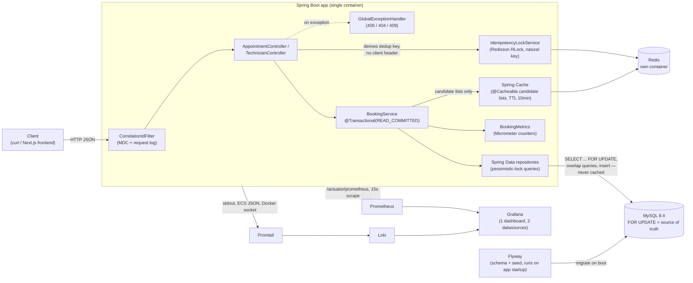

# System Design Document — Unified Service Scheduler

Scenario A (Ownership domain): a dealership appointment scheduler. The
problem this system exists to solve is narrow and specific — **two requests
racing for the same technician or service bay must never both get
confirmed** — and every decision below is built around making that
guarantee real, not just documented. This is the consolidated design
document: it folds in the Redis/observability layer and the guest-booking /
explicit-technician-choice / frontend work added after the initial
submission, so there is one current picture rather than a base doc plus
addenda.

---

## 1. Architecture Diagram

Seven Docker Compose services: `app` (the Spring Boot jar), `mysql`,
`redis`, `prometheus`, `grafana`, `loki`, `promtail`. `docker compose up
--build` boots the whole stack with no manual host setup — Flyway migrates
the schema and seed data on app startup, and Grafana's datasources/dashboard
are provisioned automatically.

---

## 2. Component Roles

- **`CorrelationIdFilter`** — assigns/propagates a correlation id per
  request via MDC (reuses an inbound `X-Correlation-Id` header if present),
  echoes it in the response header, and logs method/URI/status/duration on
  completion. Runs first in the filter chain so every downstream log line,
  including exceptions, carries the id.
- **`AppointmentController` / `TechnicianController`** — thin HTTP layer:
  deserialize, validate (`@Valid`), derive the idempotency key, delegate to
  `BookingService`, map the domain result to a response DTO. No business
  logic lives here.
- **`GlobalExceptionHandler`** — translates domain exceptions
  (`ResourceNotFoundException` → 404, `BookingConflictException` → 409,
  `MethodArgumentNotValidException` → 400) into a consistent `ErrorResponse`
  body carrying the correlation id, so a caller can hand that id to
  logs/dashboards when reporting a problem.
- **`IdempotencyLockService`** (Redisson `RLock`) — gates duplicate
  concurrent `POST /appointments` submits before they reach `BookingService`.
  The dedup key is derived server-side from the request's own fields (§3),
  not a client-supplied token. `tryLock` with zero wait: a second submit
  while the first is in flight gets an immediate `409` instead of queuing.
  Redis unreachable → logs a warning and proceeds as if no key existed
  (fail-open). This is a UX/dedup convenience, not a correctness mechanism.
- **`BookingService`** — the only place business logic lives. Given a
  `(vehicle-or-guest-fields, serviceType, dealershipId, window,
  optional technicianId)` command, it resolves/creates the vehicle,
  auto-assigns (or validates an explicitly chosen) qualified, available
  technician and a free service bay, and persists the appointment — all
  inside one transaction. This is also where the concurrency-safety
  guarantee is implemented (§3).
- **Spring Cache (`@Cacheable`)** — wraps the two read-only
  candidate-list repository calls `BookingService` iterates before locking
  a specific row (`TechnicianRepository.findBySpecialtyAndDealershipIdOrderById`,
  `ServiceBayRepository.findByDealershipIdOrderById`). 10-minute TTL, no
  active invalidation (no update/delete endpoint exists for
  technician/bay master data). A custom `CacheErrorHandler` logs and
  swallows Redis get/put/evict/clear errors — Spring's default behavior
  lets a cache failure propagate as an exception, which would turn a Redis
  outage into a broken booking request; that's the opposite of fail-open.
- **`BookingMetrics`** — two Micrometer counters
  (`booking.attempts.total`, `booking.conflicts.total`) so the
  business-relevant "conflict rate" can be computed and alerted on
  externally, rather than being a single opaque number baked into the app.
- **Spring Data repositories** — own every SQL/JPQL query, including the
  pessimistic-lock reads (`lockById`, `SELECT ... FOR UPDATE`) and the
  overlap-detection queries. Keeping these as named, tested repository
  methods (rather than inline queries in the service) makes the overlap
  semantics independently testable.
- **MySQL 8.4** — system of record, and the enforcement point for
  concurrency safety: the row locks that make booking safe are MySQL locks,
  not application-level locks, so they hold even if the app is scaled to
  multiple instances.
- **Redis** — single-node container, backs the idempotency lock and the
  candidate-list cache. Never consulted by the overlap/availability check
  itself — that line only ever runs against MySQL.
- **Flyway** — versioned schema (`V1`) and seed data (`V2`–`V4`), applied
  automatically on app startup. No manual DB setup step for a reviewer.
- **Prometheus** — scrapes the app's `/actuator/prometheus` endpoint on a
  15s interval.
- **Promtail** — tails the `app` container's stdout via the Docker socket
  and ships it to Loki. Chosen over Docker's native `loki` logging driver,
  which needs a one-time `docker plugin install` on the host — that would
  break the project's zero-manual-step reviewer workflow. Config stays
  trivial because the app's logs are already structured JSON.
- **Loki** — log storage/query backend for Promtail's output.
- **Grafana** — one dashboard, two datasources (Prometheus + Loki), so
  metrics and logs for the same request/correlation id sit side by side.
- **Frontend (Next.js, `frontend/`, not the graded deliverable)** — a demo
  UI for exercising the API visually: a booking flow (dealership → service
  → guest vehicle → calendar/slot picker → optional technician choice →
  contact info) and a ticket-lookup page, built on Tailwind v4 + shadcn/ui.
  Calls the same REST API a curl client would, nothing it does is
  load-bearing for correctness.

---

## 3. Data Flow: `POST /appointments`

1. Request passes through `CorrelationIdFilter` (id stamped/echoed).
2. `AppointmentController` derives a dedup key from the request's own
   fields: `desiredStart|desiredEnd|dealershipId|serviceType|
   technicianId-or-"any"|email-or-vehicleId`. `IdempotencyLockService`
   attempts a zero-wait Redis lock on that key.
   - Not acquired → immediate `409`, `BookingService` never runs.
   - Redis unreachable → warning logged, proceeds without the lock.
3. Request validated (`@Valid`): required fields present, `desiredEnd`
   after `desiredStart`, and either `vehicleId` or the full guest-field set
   (`customerName`/`customerEmail`/`vehicleVin`/`vehicleMake`/`vehicleModel`)
   present.
4. `BookingService.bookAppointment` opens a transaction at
   **`READ_COMMITTED`** isolation (deliberately overriding MySQL's default
   `REPEATABLE_READ` — see below) and resolves the vehicle: an existing
   `vehicleId` is loaded as-is (404 if absent); otherwise this is a guest
   booking — find-or-create the `Customer` by email, then find-or-create
   the `Vehicle` by VIN under that customer.
5. Technician selection:
   - If `technicianId` was given explicitly: lock that row (`FOR UPDATE`),
     verify it belongs to the requested `dealershipId` (404 if not),
     check overlap (409 if busy). No specialty re-check — the caller
     already saw a specialty-filtered list from the availability endpoint.
   - Otherwise (auto-assign): for each technician whose `specialty`
     matches `serviceType` at the given `dealershipId`, in id order,
     acquire `SELECT ... FOR UPDATE` on that technician row, then check
     for an overlapping `CONFIRMED` appointment. The first technician with
     no overlap is selected; the lock stays held for the rest of the
     transaction. Candidate lists come from the 10-minute cache (§2); the
     lock and overlap check always hit MySQL directly, uncached.
6. Same lock-then-check pattern for `ServiceBay` at that dealership.
7. If both were found, insert the `Appointment` as `CONFIRMED` and commit
   (`201`). If either search came up empty, roll back and return `409`
   (releasing every lock acquired so far).
8. `BookingMetrics` records the attempt, and a conflict if step 7 failed.
9. The idempotency lock (step 2) is released in a `finally` block — the
   30s lease is also a backstop if release is skipped (e.g. a crash
   mid-request).

### Why this actually prevents double-booking

The row lock from step 5/6 is the synchronization primitive — not the
overlap query by itself. Two transactions racing for the same technician
both try to lock that technician's row; the second one blocks until the
first commits or rolls back. Once unblocked, its overlap check runs against
whatever the first transaction just committed. That ordering — lock, *then*
observe committed state — is what turns "check, then act" (inherently
racy) into "acquire exclusive access, then check, then act" (safe).

That ordering is also exactly what MySQL's default `REPEATABLE_READ`
isolation breaks: under `REPEATABLE_READ`, a transaction's plain
(non-locking) `SELECT`s all read from a snapshot fixed at the transaction's
*first* plain read — in this code, that's the vehicle lookup in step 4,
which happens *before* any lock is acquired. So even after correctly
waiting for the lock, the overlap check would still see the pre-lock
snapshot and never observe the other transaction's now-committed
appointment. This was caught by a dedicated concurrency test (8 concurrent
requests for the same technician/slot; the first version of the code let
all 8 succeed) and fixed by forcing `READ_COMMITTED` isolation, under which
every plain read re-reads the latest committed data. `FOR UPDATE` locking
reads are unaffected by isolation level either way — they always see
latest-committed data — but the plain overlap-check reads are not, and
isolation level is what governs whether they do.

**Alternatives considered:**
- *Optimistic locking (`@Version`)* — natural fit for "update a row I
  already loaded," but this is "insert a new row after checking a set of
  siblings for overlap" — there's no single existing row to version.
- *DB-level exclusion constraint on time ranges* — the cleanest fix
  conceptually (e.g. Postgres `EXCLUDE USING gist`), but not available in
  MySQL without extensions, so not viable given the MySQL choice below.
- *A second Redis-based distributed lock on the same resource* — floated
  early for the Redis addition, rejected: MySQL row locking already
  provides the multi-instance-safe correctness guarantee, so a second
  locking layer on the *same* resource would be redundant at best,
  contradictory at worst. Redis's lock in this design guards a *different*
  concern (duplicate submissions), not booking correctness.

**Why a derived idempotency key instead of a client-supplied
`Idempotency-Key` header** (the original design for step 2): a
client-generated token is the standard pattern (Stripe-style), but it
requires the client to generate and track one — and `technicianId` can't be
part of a client-chosen key when auto-assign is exactly what leaves it
unknown at request time. A key derived from the request's own fields needs
no client cooperation and naturally can't collide across different
customers or time slots.

---

## 4. Technology Choices

| Choice | Why |
|---|---|
| Java 21 + Spring Boot 4.0.7 | Boot 3 was the original target, but `start.spring.io` had moved to Boot 4.0+ only by build time; no functional cost for this project, and it kept the stack current. |
| MySQL 8.4 (not H2) | The concurrency guarantee is the entire point of this exercise. Testing it against H2 would prove H2's locking semantics, not MySQL's (H2's default locking is weaker/different) — so the integration test needed a real MySQL engine, which meant the app needed one too, rather than maintaining two DB configs. |
| Flyway | Versioned, repeatable schema setup; a reviewer gets seed data for free on `docker compose up`, no manual fixture step. |
| Testcontainers | Every test in the suite (overlap edge cases, the concurrency test, REST layer tests) runs against a real, disposable MySQL container instead of mocks — a passing test means the actual SQL and locking behavior work, not that a mock was configured to agree with the implementation. |
| Pessimistic locking over optimistic / app-level locks | See §3. Row locks in the DB also mean the guarantee holds if the app is horizontally scaled — no in-process mutex would. |
| Redisson (not plain Jedis/Lettuce + manual `SETNX`) | `RLock` gives lease/watchdog semantics out of the box instead of hand-rolling TTL-based mutual exclusion and its edge cases (clock skew, missed unlock). |
| Spring Cache abstraction over raw `RedisTemplate` | Keeps caching declarative and out of `BookingService`'s business logic — consistent with the codebase's "thin, single-purpose components" pattern. |
| Server-derived dedup key over client `Idempotency-Key` header | No client-side token generation/tracking needed; the key is exactly the fields that define "is this the same request," including the "any technician" case a client-chosen key can't express. |
| Prometheus + Grafana + Loki over an ELK-style stack | Lower resource footprint for a demo-scope project; needs no application code changes since Micrometer metrics and structured JSON logs already existed for this purpose. |
| Promtail sidecar over Docker's native `loki` logging driver | The driver needs `docker plugin install` on the host — breaks the `docker compose up --build`-only reviewer workflow. Promtail costs one extra container, zero host setup. |
| Single-node Redis, no clustering/Sentinel | Matches the demo-scope MySQL setup (also single node); no HA requirement at this scale. |
| Next.js + Tailwind v4 + shadcn/ui (frontend) | Fast to stand up a real calendar/slot-picker UI without hand-rolling date-picker/select accessibility; not the graded deliverable, so minimizing custom component code was the priority. |

---

## 5. Observability Strategy

- **Logging.** Structured JSON (`logging.structured.format.console=ecs`,
  Spring Boot's built-in structured logging support) so log lines are
  directly ingestible by a log aggregator without a separate parsing step.
  Every request carries a correlation id (generated or propagated from an
  inbound `X-Correlation-Id` header) via MDC, echoed back in the response
  header and in every `ErrorResponse` body, so a caller reporting an issue
  can hand back an id that ties directly to server-side log lines for that
  request. Promtail tails the app container's stdout via the Docker socket
  and ships those same lines to Loki — the only change from "logs exist" to
  "logs are queryable in Grafana" is a consumer, no format change, since
  the JSON was already structured for this purpose.
- **Metrics.** Exposed at `/actuator/prometheus`, scraped by Prometheus on
  a 15s interval. Beyond the default JVM/HTTP metrics Spring Boot ships,
  two business-specific counters exist: `booking.attempts.total` and
  `booking.conflicts.total`. The ratio of these is the "booking conflict
  rate" — a metric that says something about the business (is demand
  outstripping capacity for a given technician/dealership?) rather than
  only about the system's health. Kept as two raw counters rather than a
  single computed gauge so the aggregation window is the observer's choice
  (Prometheus/Grafana), not baked into the app.
- **Health.** `/actuator/health` reports DB connectivity, used by
  `docker-compose.yml`'s implicit startup ordering and would back a
  container orchestrator's liveness/readiness probes in a real deployment.
- **Dashboards.** One Grafana dashboard, provisioned automatically (no
  manual "add datasource" step for a reviewer): booking attempts vs.
  conflicts rate, HTTP request rate by status, JVM heap, and a live logs
  panel scoped to the app container — metrics and logs for the same
  correlation id sit side by side.
- **Tracing.** Not implemented — a single-service backend with no
  downstream service calls doesn't get much from distributed tracing yet.
  The correlation-id filter is deliberately the seam where a real tracer
  (e.g. Micrometer Tracing + OpenTelemetry) would slot in without other
  changes: it already stamps every request and log line with an id in MDC.
- **Failure-mode principle.** None of the observability or Redis layer
  ever gates a booking outcome. Redis down degrades the cache to
  cache-miss-always and skips the idempotency lock (both logged);
  Prometheus/Loki/Grafana being down affects nothing about `/appointments`
  at all — they only observe it. MySQL row locking (§3) is still the only
  mechanism that has ever prevented a double booking.

---

## 6. How GenAI Was Used in the Design Phase

The technical design (stack, data model, locking approach, Docker layout,
test strategy) came in largely pre-formed from the person doing the
exercise, based on prior experience with this class of problem. Claude
Code's role in the design phase was to pressure-test that plan before any
code got written, using its own project-planning workflow (explore → design
→ clarify → write plan), not to originate the architecture. Concrete
catches from that process:

1. **Missing auto-assignment field.** The `POST /appointments` request
   shape (`vehicleId`, `serviceType`, `dealershipId`, a time window) has no
   field for `technicianId` or `serviceBayId` — so *something* has to
   decide auto-assignment, and the original plan didn't specify how.
   Resolved by adding a `specialty` string on `Technician` and matching it
   against `serviceType`, plus scoping technicians to a `dealershipId`
   (not in the original field list) so a technician from the wrong
   location can never get auto-assigned to a booking at a different
   dealership.
2. **Test-strategy contradiction.** The deliverables checklist said
   "Testcontainers integration," but an earlier section of the same plan
   described an H2-only test strategy — a direct contradiction. Raised
   explicitly rather than silently picking one; resolved in favor of a
   real MySQL container for every test.
3. **Redis-lock-vs-DB-lock scope.** The initial idea for the Redis
   addition floated "add Redis for cache, distributed lock" without
   specifying what the distributed lock would protect. Since MySQL row
   locking already provides the multi-instance-safe correctness guarantee,
   a second locking layer on the *same* resource would be redundant at
   best, contradictory at worst. Resolved as an idempotency/dedup lock on
   a *different* concern (duplicate submissions), not a second
   booking-correctness mechanism.
4. **Docker's native Loki logging driver vs. Promtail.** The original plan
   picked the native driver for one fewer container. While pinning exact
   dependency versions before writing the implementation plan, this
   research surfaced that the driver requires `docker plugin install` on
   the host — silently breaking the project's own stated zero-manual-step
   guarantee. Caught and reversed before implementation.
5. **Cache fail-open gap.** Spring's default `@Cacheable` behavior lets a
   Redis connection failure propagate as an exception out of the annotated
   method — the opposite of the fail-open principle the whole Redis
   addition is built on. Caught during the implementation plan's
   self-review (before any code was written), fixed by adding an explicit
   `CacheErrorHandler`.
6. **Missing Prometheus dependency.** `management.endpoints.web.exposure.include`
   listed `prometheus`, but `micrometer-registry-prometheus` was never
   actually a project dependency — the endpoint 404'd. This wasn't caught
   by planning or by the test suite (no test exercises actuator
   endpoints); it was only caught by actually bringing the full Docker
   stack up and checking Prometheus's own scrape-target status — exactly
   the category of gap "does it actually work end to end" verification
   exists to catch rather than trusting a green build.

All six were surfaced as direct questions or explicit plan revisions before
implementation started, not guessed at silently and not implemented
ambiguously. The implementation phase (writing the actual Java code and
tests, including two real bugs the AI-written code shipped with that only
concurrent-load and dedicated-endpoint testing caught) is covered in the
[README's AI Collaboration Narrative](../README.md#ai-collaboration-narrative).
