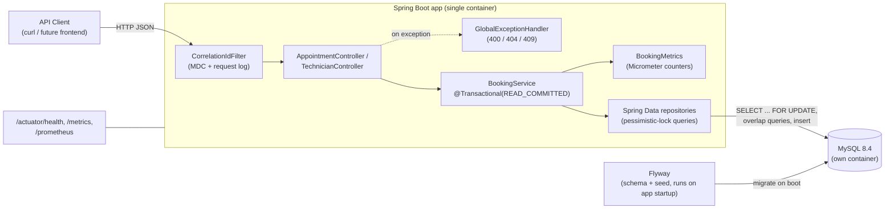

# System Design Document — Unified Service Scheduler

Scenario A (Ownership domain): backend implementation of a dealership
appointment scheduler. The problem this system exists to solve is narrow and
specific — **two requests racing for the same technician or service bay must
never both get confirmed** — and the design below is built around making
that guarantee real, not just documented.

## 1. Architecture

Everything runs as two Docker Compose services: `app` (the Spring Boot jar)
and `mysql`. There is no separate cache, queue, or gateway layer — the
scenario doesn't call for one, and adding one would be solving a problem
this system doesn't have.

## 2. Component Roles

- **`CorrelationIdFilter`** — assigns/propagates a correlation id per
  request via MDC, and logs method/URI/status/duration on completion. Runs
  first in the filter chain so every downstream log line (including
  exceptions) carries the id.
- **`AppointmentController` / `TechnicianController`** — thin HTTP layer:
  deserialize, validate (`@Valid`), delegate to `BookingService`, map the
  domain result to a response DTO. No business logic lives here.
- **`GlobalExceptionHandler`** — translates domain exceptions
  (`ResourceNotFoundException` → 404, `BookingConflictException` → 409,
  `MethodArgumentNotValidException` → 400) into a consistent `ErrorResponse`
  body carrying the correlation id, so a caller can hand that id to
  logs/traces when reporting a problem.
- **`BookingService`** — the only place business logic lives. Given a
  `(vehicleId, serviceType, dealershipId, window)` command, it auto-assigns
  a qualified, available technician and a free service bay, and persists
  the appointment — all inside one transaction. This is also where the
  concurrency-safety guarantee is implemented (§3).
- **`BookingMetrics`** — two Micrometer counters
  (`booking.attempts.total`, `booking.conflicts.total`) so the
  business-relevant "conflict rate" can be computed and alerted on
  externally, rather than being a single opaque number baked into the app.
- **Spring Data repositories** — own every SQL/JPQL query, including the
  pessimistic-lock reads (`lockById`, `SELECT ... FOR UPDATE`) and the
  overlap-detection queries. Keeping these as named, tested repository
  methods (rather than inline queries in the service) makes the overlap
  semantics independently testable (see `AppointmentRepositoryOverlapTest`).
- **MySQL 8.4** — system of record. Also the enforcement point for
  concurrency safety: the row locks that make booking safe are MySQL locks,
  not application-level locks, so they hold even if the app were scaled to
  multiple instances.
- **Flyway** — versioned schema (`V1__init_schema.sql`) and seed data
  (`V2__seed_data.sql`), applied automatically on app startup. There is no
  manual DB setup step for a reviewer running this project.

## 3. Data Flow: `POST /appointments`

1. Request validated (`@Valid`): required fields present, `desiredEnd` after
   `desiredStart`.
2. `BookingService.bookAppointment` opens a transaction at
   **`READ_COMMITTED`** isolation (deliberately overriding MySQL's default
   `REPEATABLE_READ` — see §4) and looks up the `Vehicle` (404 if absent).
3. For each technician whose `specialty` matches `serviceType` at the given
   `dealershipId`, in id order: acquire `SELECT ... FOR UPDATE` on that
   technician row, then check for an overlapping `CONFIRMED` appointment. The
   first technician with no overlap is selected; the lock stays held for the
   rest of the transaction.
4. Same pattern for `ServiceBay` at that dealership.
5. If both were found, insert the `Appointment` as `CONFIRMED` and commit
   (`201`). If either search came up empty, roll back and return `409`
   (releasing both locks).
6. `BookingMetrics` records the attempt, and a conflict if step 5 failed.

### Why this actually prevents double-booking

The row lock from step 3/4 is the synchronization primitive — not the
overlap query by itself. Two transactions racing for the same technician
both try to lock that technician's row; the second one blocks until the
first commits or rolls back. Once unblocked, its overlap check runs against
whatever the first transaction just committed. That ordering — lock, *then*
observe committed state — is what turns "check, then act" (inherently
racy) into "acquire exclusive access, then check, then act" (safe).

That ordering is also exactly what MySQL's default `REPEATABLE_READ`
isolation breaks: under `REPEATABLE_READ`, a transaction's plain
(non-locking) `SELECT`s all read from a snapshot fixed at the transaction's
*first* plain read — in this code, that's the vehicle lookup in step 2,
which happens *before* any lock is acquired. So even after correctly
waiting for the lock, the overlap check would still see the pre-lock
snapshot and never observe the other transaction's now-committed
appointment. This was caught by
`BookingServiceConcurrencyTest` (8 concurrent requests for the same
technician/slot; first version of the code let all 8 succeed) and fixed by
forcing `READ_COMMITTED` isolation, under which every plain read re-reads
the latest committed data. `FOR UPDATE` locking reads are unaffected by
isolation level either way — they always see latest-committed data — but
the plain overlap-check reads are not, and isolation level is what governs
whether they do.

**Alternatives considered:**
- *Optimistic locking (`@Version`)* — natural fit for "update a row I
  already loaded," but this is "insert a new row after checking a set of
  siblings for overlap" — there's no single existing row to version.
- *DB-level exclusion constraint on time ranges* — the cleanest fix
  conceptually (e.g. Postgres `EXCLUDE USING gist`), but not available in
  MySQL without extensions, so not viable given the MySQL choice below.

## 4. Technology Choices

| Choice | Why |
|---|---|
| Java 21 + Spring Boot 4 | Boot 3 was the original target, but `start.spring.io` had moved to Boot 4.0+ only by build time; no functional cost for this project, and it kept the stack current. |
| MySQL 8.4 (not H2) | The concurrency guarantee is the entire point of this exercise. Testing it against H2 would prove H2's locking semantics, not MySQL's (H2's default locking is weaker/different) — so the integration test needed a real MySQL engine, which meant the app needed one too, rather than maintaining two DB configs. |
| Flyway | Versioned, repeatable schema setup; a reviewer gets seed data for free on `docker compose up`, no manual fixture step. |
| Testcontainers | Every test in the suite (overlap edge cases, the concurrency test, REST layer tests) runs against a real, disposable MySQL container instead of mocks — a passing test means the actual SQL and locking behavior work, not that a mock was configured to agree with the implementation. |
| Pessimistic locking over optimistic / app-level locks | See §3. Row locks in the DB also mean the guarantee holds if the app is horizontally scaled — no in-process mutex would. |

## 5. Observability Strategy

- **Logging.** Structured JSON (`logging.structured.format.console=ecs`,
  Spring Boot's built-in structured logging support) so log lines are
  directly ingestible by a log aggregator without a separate parsing step.
  Every request carries a correlation id (generated or propagated from an
  inbound `X-Correlation-Id` header) via MDC, echoed back in the response
  header and in every `ErrorResponse` body, so a caller reporting an issue
  can hand back an id that ties directly to server-side log lines for that
  request.
- **Metrics.** Exposed at `/actuator/prometheus`. Beyond the default JVM/HTTP
  metrics Spring Boot ships, two business-specific counters exist:
  `booking.attempts.total` and `booking.conflicts.total`. The ratio of
  these is the "booking conflict rate" — a metric that says something about
  the business (is demand outstripping capacity for a given
  technician/dealership?) rather than only about the system's health.
  Kept as two raw counters rather than a single computed gauge so the
  aggregation window is the observer's choice (Prometheus/Grafana), not
  baked into the app.
- **Health.** `/actuator/health` reports DB connectivity, used by
  `docker-compose.yml`'s implicit startup ordering and would back a
  container orchestrator's liveness/readiness probes in a real deployment.
- **Tracing.** Not implemented — a single-service backend with no downstream
  service calls doesn't get much from distributed tracing yet. The
  correlation-id filter is deliberately the seam where a real tracer (e.g.
  Micrometer Tracing + OpenTelemetry) would slot in without other changes:
  it already stamps every request and log line with an id in MDC.

## 6. How GenAI Was Used in the Design Phase

The technical design (stack, data model, locking approach, Docker layout,
test strategy) came in largely pre-formed from the person doing the
exercise, based on prior experience with this class of problem. Claude
Code's role in the design phase was to pressure-test that plan before any
code got written, using its own project-planning workflow (explore → design
→ clarify → write plan), and two real gaps got caught this way:

1. The `POST /appointments` request shape (`vehicleId`, `serviceType`,
   `dealershipId`, a time window) has no field for `technicianId` or
   `serviceBayId` — so *something* has to decide auto-assignment, and the
   original plan didn't specify how. Resolved by adding a `specialty`
   string on `Technician` and matching it against `serviceType`, plus
   scoping technicians to a `dealershipId` (not in the original field list)
   so a technician from the wrong location can never get auto-assigned to a
   booking at a different dealership.
2. The deliverables checklist said "Testcontainers integration," but an
   earlier section of the same plan described an H2-only test strategy —
   a direct contradiction. Raised explicitly rather than silently picking
   one; resolved in favor of a real MySQL container for every test (see §4).

Both were surfaced as direct questions before implementation started, not
guessed at silently and not implemented ambiguously. The implementation
phase (writing all the actual Java code and tests) is covered separately in
the [README's AI Collaboration Narrative](../README.md#ai-collaboration-narrative),
including two real bugs the AI-written code shipped with that only
concurrent-load and dedicated-endpoint testing caught.
