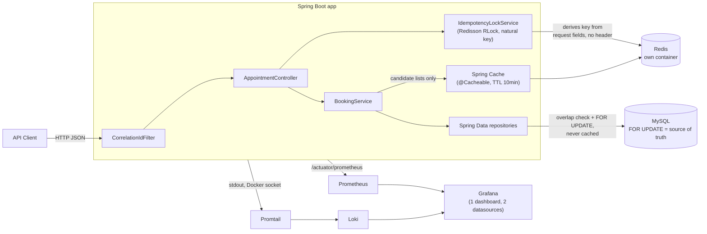

# System Design Document — Redis Layer & Observability Stack

Addendum to the [main System Design Document](design.md), covering the
Redis (candidate-list cache + idempotency dedup) and Prometheus/Grafana/Loki
additions made after the initial Scenario A submission. Same standard this
project holds itself to throughout: **the addition must never weaken the
double-booking guarantee** in [design.md §3](design.md#3-data-flow-post-appointments)
— MySQL row locking is still the only mechanism that has ever prevented two
requests from confirming the same technician/bay slot. Everything here is
additive and fails open.

## 1. Architecture

Five new `docker-compose.yml` services — `redis`, `prometheus`, `grafana`,
`loki`, `promtail` — alongside the original `app`/`mysql`. No change to
`app`/`mysql`'s own behavior; `docker compose up --build` still boots the
whole stack with no manual host setup.

## 2. Component Roles

- **Redis** — single-node container, backs both features below. Never
  consulted by the overlap/availability check itself.
- **`IdempotencyLockService`** (Redisson `RLock`) — gates duplicate
  concurrent `POST /appointments` submits. The dedup key is derived
  server-side from the request itself (§3), not a client-supplied token.
  `tryLock` with zero wait: a second submit while the first is in flight
  gets an immediate `409` instead of queuing. Redis unreachable → logs a
  warning and proceeds as if no key existed (fail-open).
- **Spring Cache (`@Cacheable`)** — wraps
  `TechnicianRepository.findBySpecialtyAndDealershipIdOrderById` and
  `ServiceBayRepository.findByDealershipIdOrderById` only — the read-only
  candidate lists `BookingService` iterates before locking a specific row.
  10-minute TTL, no active invalidation (no update/delete endpoint exists
  for technician/bay master data). A custom `CacheErrorHandler` logs and
  swallows Redis errors on get/put — Spring's default behavior is to let a
  cache failure propagate as an exception, which would turn a Redis outage
  into a broken booking request; that's the opposite of fail-open.
- **Prometheus** — scrapes the app's existing `/actuator/prometheus`.
  Required adding `micrometer-registry-prometheus` as an actual dependency
  (see §6) — the endpoint was listed in
  `management.endpoints.web.exposure.include` but 404'd without it.
- **Promtail** — tails the `app` container's stdout via the Docker socket
  and ships it to Loki. Chosen over Docker's native `loki` logging driver,
  which needs a one-time `docker plugin install` on the host — that would
  break the project's zero-manual-step reviewer workflow. Config stays
  trivial because the app's logs are already structured JSON (ECS format,
  see design.md §5) — no parsing regex needed.
- **Loki** — log storage/query backend for Promtail's output.
- **Grafana** — one dashboard, two datasources (Prometheus + Loki), so
  metrics and logs for the same request/correlation id sit side by side.

## 3. Data Flow — `POST /appointments`

1. Request passes through `CorrelationIdFilter` as in the base design.
2. Controller derives a dedup key from the request itself:
   `desiredStart|desiredEnd|dealershipId|serviceType|technicianId-or-"any"|email-or-vehicleId`
   — no client header. `IdempotencyLockService.tryAcquire` attempts
   `tryLock(wait=0, lease=30s)` against Redis on that key.
   - Not acquired → `409` immediately, `BookingService` never runs.
   - Redis unreachable → warning logged, proceeds without the lock.
3. `BookingService.bookAppointment` runs unchanged from the base design.
   Candidate-list repository calls go through `@Cacheable`; the overlap
   query and `FOR UPDATE` lock still hit MySQL on every call, uncached.
   This is the line correctness sits behind.
4. Response is written, then the idempotency lock is released (the lease
   is also a backstop if release is skipped, e.g. a crash mid-request).

**Why a derived key instead of a client-supplied `Idempotency-Key`
header** (the original plan for this feature): the header design was
implemented first, then replaced. A client-generated token is the
standard pattern (Stripe-style), but it requires the client to generate
and track one — and `technicianId` can't be part of a client-chosen key
when auto-assign is exactly what leaves it unknown at request time. A
key derived from the request's own fields needs no client cooperation and
naturally can't collide across different customers or time slots.

## 4. Technology Choices

| Choice | Why |
|---|---|
| Redisson (not plain Jedis/Lettuce + manual `SETNX`) | `RLock` gives lease/watchdog semantics out of the box instead of hand-rolling TTL-based mutual exclusion and its edge cases (clock skew, missed unlock). |
| Spring Cache abstraction over raw `RedisTemplate` | Keeps caching declarative and out of `BookingService`'s business logic — consistent with the codebase's "thin, single-purpose components" pattern. |
| Server-derived dedup key over client `Idempotency-Key` header | No client-side token generation/tracking needed; the key is exactly the fields that define "is this the same request," including the "any technician" case a client-chosen key can't express. |
| Prometheus + Grafana + Loki over an ELK-style stack | Lower resource footprint for a demo-scope project; needs no application code changes since Micrometer metrics and structured JSON logs already existed for this purpose. |
| Promtail sidecar over Docker's native `loki` logging driver | The driver needs `docker plugin install` on the host — breaks the `docker compose up --build`-only reviewer workflow. Promtail costs one extra container, zero host setup. |
| Single-node Redis, no clustering/Sentinel | Matches the demo-scope MySQL setup (also single node); no HA requirement at this scale. |

## 5. Observability Strategy

- **Logging.** Unchanged from the base design's structured JSON (ECS
  format) with correlation-id-per-request — this addition's only change is
  a *consumer*: Promtail ships those same stdout lines to Loki instead of
  them only existing in `docker compose logs`. Querying by correlation id
  in Grafana now ties a customer-reported issue directly to every log line
  for that request, including across the idempotency-lock and cache paths.
- **Metrics.** Prometheus scrapes `/actuator/prometheus` on a 15s interval.
  Beyond the default JVM/HTTP metrics, the business-specific
  `booking.attempts.total` / `booking.conflicts.total` counters (already
  defined in the base design) are now actually queryable and dashboarded,
  not just theoretically exposed — closing the gap where the endpoint was
  configured but not functional (§6).
- **Dashboards.** One Grafana dashboard, provisioned automatically (no
  manual "add datasource" step for a reviewer): booking attempts vs.
  conflicts rate, HTTP request rate by status, JVM heap, and a live logs
  panel scoped to the app container.
- **Tracing.** Still not implemented, same rationale as the base design
  (§5): a single-service backend with no downstream calls gets little from
  distributed tracing yet. The correlation-id filter remains the seam a
  real tracer would slot into without other changes.
- **Failure-mode principle.** None of the above ever gates a booking
  outcome. Redis down degrades the cache to cache-miss-always and skips
  the idempotency lock (both logged); Prometheus/Loki/Grafana being down
  affects nothing about `/appointments` at all — they only observe it.

## 6. How GenAI Was Used in the Design Phase

Same collaboration pattern as the base design (design.md §6): the plan
came in largely pre-formed, GenAI's job was pressure-testing it and
catching contradictions before code was written. Concrete catches:

1. **Redis-lock-vs-DB-lock scope.** The initial idea floated "add Redis for
   cache, distributed lock" without specifying what the distributed lock
   would protect. Since MySQL row locking already provides the
   multi-instance-safe correctness guarantee (design.md §3/§4), a second
   locking layer on the *same* resource would be redundant at best,
   contradictory at worst. Raised directly rather than implemented
   ambiguously; resolved as an idempotency/dedup lock on a *different*
   concern (duplicate submissions) rather than a second booking-correctness
   mechanism.
2. **Docker's native Loki logging driver vs. Promtail.** The original plan
   picked the native driver for one fewer container. While pinning exact
   dependency versions before writing the implementation plan, this
   research surfaced that the driver requires `docker plugin install` on
   the host — silently breaking the project's own stated zero-manual-step
   guarantee. Caught and reversed before implementation, not after a
   reviewer hit it.
3. **Cache fail-open gap.** Spring's default `@Cacheable` behavior lets a
   Redis connection failure propagate as an exception out of the annotated
   method — the opposite of the fail-open principle this whole addition is
   built on. Caught during the implementation plan's self-review (before
   any code was written), fixed by adding an explicit `CacheErrorHandler`.
4. **Missing Prometheus dependency.** `management.endpoints.web.exposure.include`
   listed `prometheus`, but `micrometer-registry-prometheus` was never
   actually a project dependency — the endpoint 404'd. This wasn't caught
   by planning or by the test suite (no test exercises actuator endpoints);
   it was only caught by actually bringing the full Docker stack up and
   checking Prometheus's own scrape-target status, which is exactly the
   category of gap "does it actually work end to end" verification exists
   to catch rather than trusting a green build.
